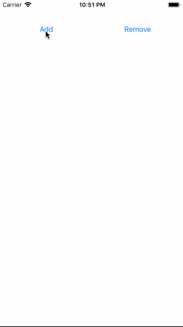

# swift-event-handler-usage-demo
A simple demo iOS application demonstrating the usage of the SwiftEventHandler framework.

When tapping on the `Add` button, a new row with the next highest number is inserted at a random position.
When tapping on the `Remove` button, a row is deleted at a random position.

